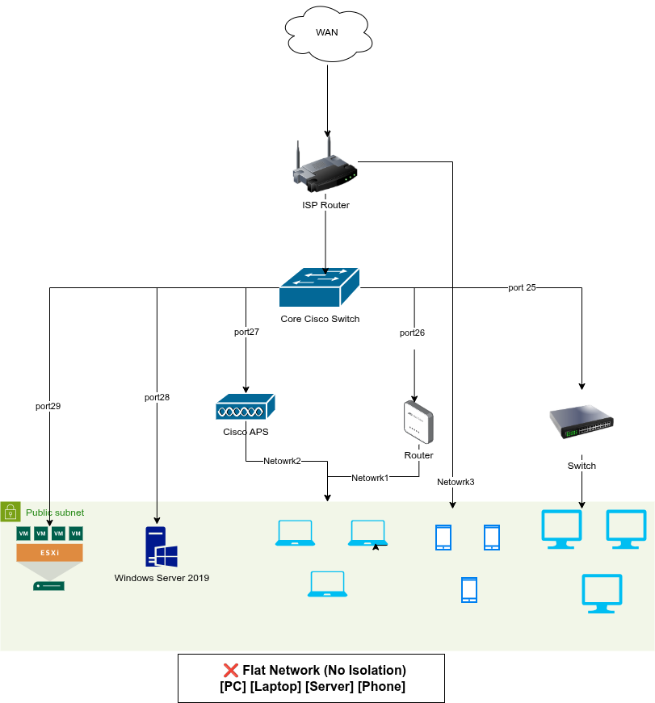
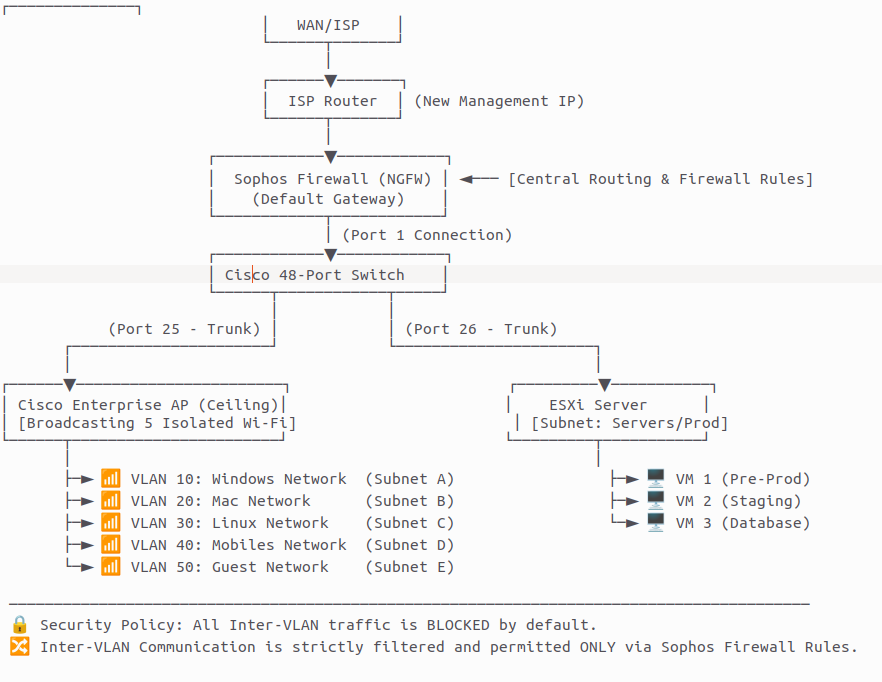

# Enterprise Network Segmentation & Infrastructure Security

## Project Overview:
Designed and implemented a secure enterprise network infrastructure using Cisco Switches and Sophos Firewall. The project focused on improving network stability, security, and traffic isolation by introducing VLAN segmentation, access control policies, and optimized wireless infrastructure.

## Business Problem:
- Network congestion.
- Departments could communicate without restrictions.
- Frequent internet instability.
- Poor Wi-Fi coverage.
- No proper network segmentation.
- Weak access control.

## Objectives:
- Improve network stability.
- Increase security.
- Isolate departments.
- Optimize Wi-Fi.
- Control user access.
- Reduce troubleshooting complexity.

## 📊 Network Architecture Comparison

### Before: Flat & Congested Infrastructure

### After: Secure Segmented Architecture

## Technologies Used
- Cisco Switching
- Sophos Firewall
- VLAN
- TCP/IP
- DHCP
- Linux
- Windows
- Network Segmentation

## Implementation
هنا بقى خطوات
### Step 1

Analyzed current network.

### Step 2

Designed VLAN topology.

### Step 3

Configured Cisco Switch.

### Step 4

Configured Sophos Firewall.

### Step 5

Created firewall rules.

### Step 6

Bound devices to dedicated networks.

### Step 7

Optimized Access Point placement.

### Step 8

Validated connectivity.

## Results:
- Eliminated inter-department visibility.
- Improved network stability.
- Increased infrastructure security.
- Reduced network-related user complaints.
- Simplified network administration.

## Lessons Learned:
- VLAN Planning
- Firewall Design
- Network Isolation
- Wireless Optimization
- Infrastructure Troubleshooting

